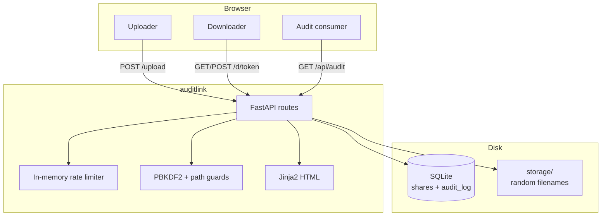

# auditlink

## what it is

Tiny secure file share: upload -> tokenised link, optional passphrase, expiry, download cap, append-only audit log. Demo, not Dropbox.

## layout

```
auditlink/
  README.md
  NOTES.md           # scratch for future me
  app/               # fastapi
  tests/
  storage/           # uploaded bytes (gitignored)
  Dockerfile
```

## quick start

```bash
cd auditlink
python3 -m venv .venv
source .venv/bin/activate
pip install -r requirements.txt

# PROD / anything public: MUST set AUDIT_TOKEN before uvicorn.
# Unset = /api/audit is OPEN - demo/local only. Do not ship that.
export AUDIT_TOKEN='long-random-secret'

uvicorn app.main:app --reload --port 8000
# open http://127.0.0.1:8000
```

Optional Docker:

```bash
docker build -t auditlink .
docker run --rm -p 8000:8000 \
  -e AUDIT_TOKEN=change-me \
  -v auditlink-data:/app/data \
  -v auditlink-files:/app/storage \
  auditlink
```

Protect `/api/audit` when you care:

```bash
export AUDIT_TOKEN='long-random-secret'
curl -H "X-Audit-Token: $AUDIT_TOKEN" http://127.0.0.1:8000/api/audit
```

**AUDIT_TOKEN:** if unset, `/api/audit` is open. That is demo-only. Production **must** set it - otherwise anyone can read the audit trail.

## stack

Python · FastAPI · SQLite · Jinja2 · Docker · pytest

## how its wired



Upload writes bytes under `storage/` with a random name; DB keeps the original filename + token + expiry + download budget. Download path checks rate limit -> expiry -> max downloads -> passphrase, then serves the file and logs the event.

## whats interesting

- tokenised links (`secrets.token_urlsafe`) - better than `/file/1`, `/file/2`
- passphrases hashed with pbkdf2 (260k iters) + `compare_digest`
- blobs never use the client path as the on-disk name; `resolve_under_storage` rejects `..`
- append-only `audit_log` (upload / download_success / download_denied / expired / rate_limited)
- download + result pages show a tiny expiry countdown
- upload path has a clamav stub comment - would scan before `create_share`, not wired for real

### threat model (keep in interviews)

- path traversal - blocked via `resolve_under_storage`
- brute force downloads - rate limit 20/min/IP
- link leakage - treat token urls as secrets
- rate limit is in-memory - resets on restart, not multi-worker safe
- what we didn't do - no e2e encryption, no real malware scanning

## limitations

- **AUDIT_TOKEN must be set in prod.** unset = `/api/audit` wide open. that open mode is demo-only
- sqlite single-process - not multi-node
- rate limiter in ram (resets on restart; two workers = two counters)
- no tls in-app - put a reverse proxy in front if you deploy
- no accounts / org tenancy - link secrecy (+ optional passphrase) is the model
- max upload default 10 MB (`AUDITLINK_MAX_UPLOAD`)

## tests

```bash
pytest -q
```

Named checks worth knowing: `test_expired_share_denied` -> expired link 410; `test_max_downloads` -> max downloads denied.

## demo

```bash
uvicorn app.main:app --reload --port 8000
```

Open http://127.0.0.1:8000 - upload a file, open the link, try download with/without a passphrase.
